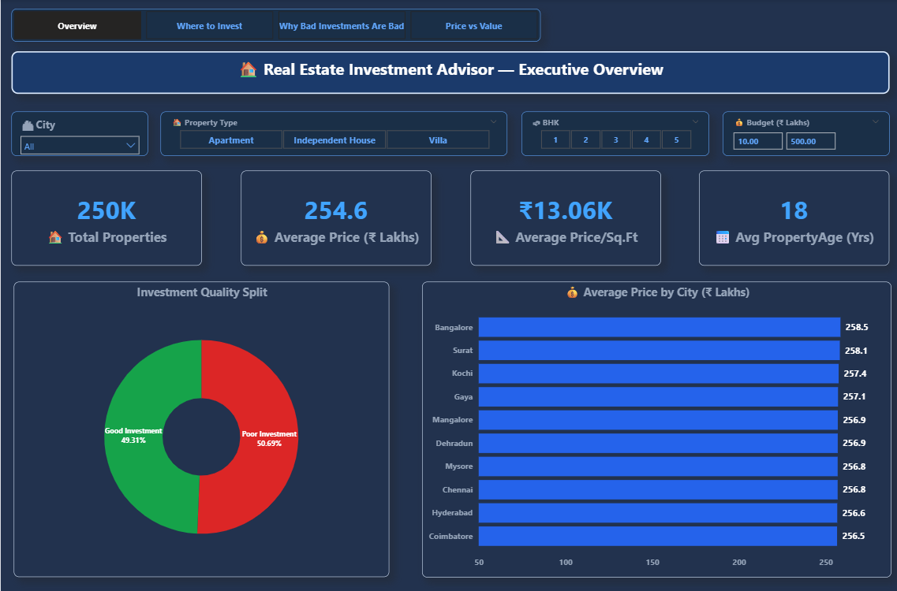
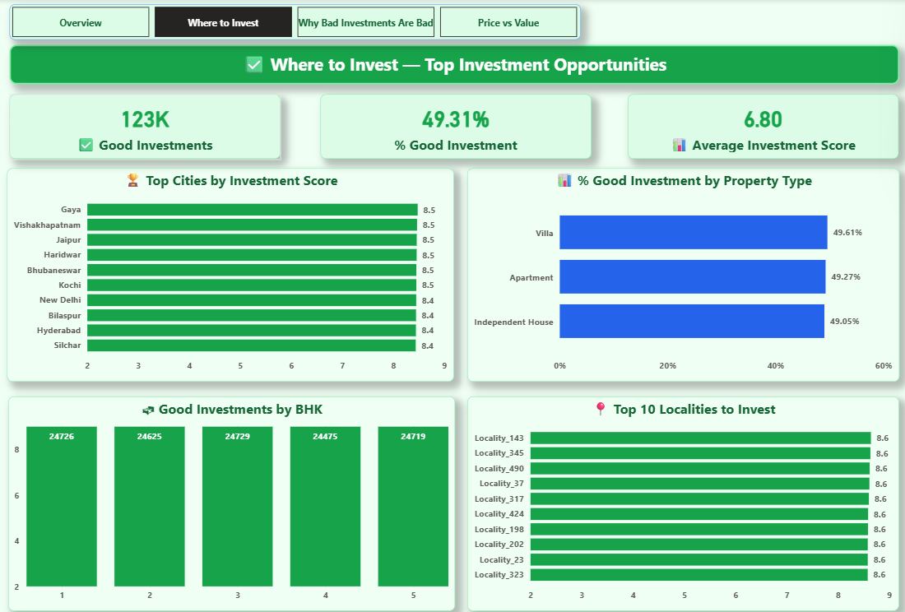
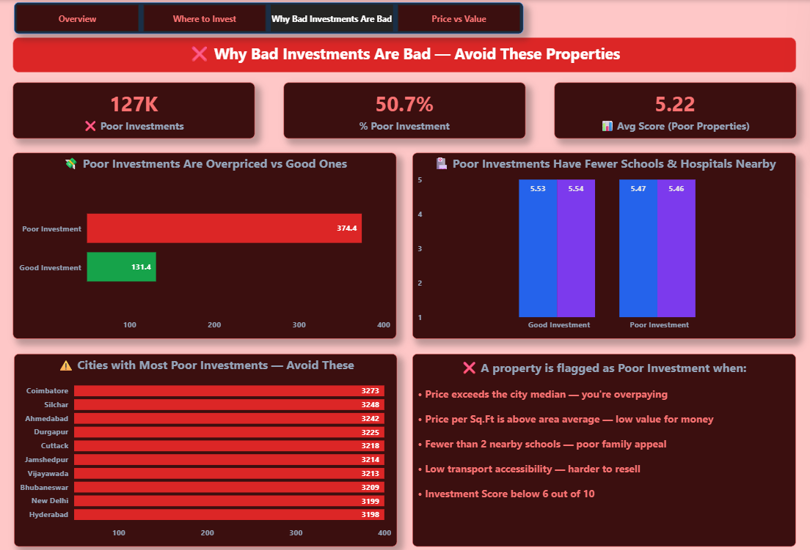
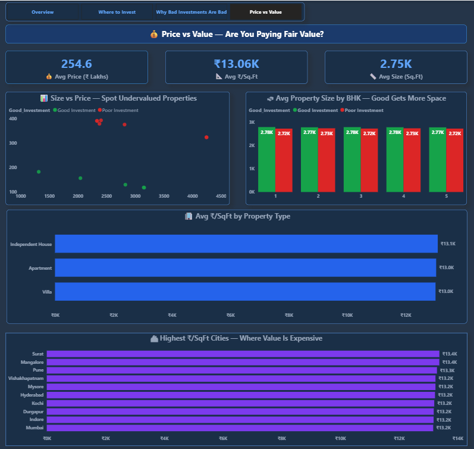

# 🏠 Real Estate Investment Advisor — Power BI Dashboard

> A professional Power BI dashboard built on **250,000 Indian housing records** 
> to help investors identify profitable properties and avoid poor investments.

---

## 📌 Project Overview

Real estate investment decisions are complex and data-heavy. This dashboard 
simplifies that process by analyzing 250,000 properties across Indian cities 
and automatically classifying each property as a **Good Investment** or 
**Poor Investment** using a custom scoring algorithm built in DAX.

Clients can filter by city, budget, BHK, and property type — and instantly 
see which properties are worth investing in and exactly why others are not.

---

## 📊 Dashboard Pages

| Page | Theme | Purpose |
|------|-------|---------|
| 🏠 **Executive Overview** | Dark Blue | Portfolio KPIs, investment split, city price comparison |
| ✅ **Where to Invest** | Dark Green | Top cities, best localities, BHK breakdown |
| ❌ **Why Bad Investments Are Bad** | Dark Red | 127K poor properties explained with reasons |
| 💰 **Price vs Value** | Dark Blue | Size vs price scatter, PSF analysis, value comparison |

---

## 📸 Screenshots

### 🏠 Page 1 — Executive Overview


### ✅ Page 2 — Where to Invest


### ❌ Page 3 — Why Bad Investments Are Bad


### 💰 Page 4 — Price vs Value


---

## 🔍 Key Insights

- ✅ **123,274 Good Investments** identified out of 250,000 properties (49.3%)
- ❌ **Poor investments cost 3× more** — ₹374L avg vs ₹131L for good ones
- 🏆 **Bangalore, Pune & Chennai** are top cities by investment score
- 🛏 **3 BHK properties** show the best investment potential
- 🏥 Properties near schools & hospitals score significantly higher
- 📐 **Independent Houses** have the highest ₹/SqFt value

---

## 🧠 How the Investment Score Works

Each property is scored **0–10** using this custom DAX algorithm:

| Factor | Max Points | Logic |
|--------|-----------|-------|
| Price vs City Median | 2 | Price at or below city median = 2 pts |
| PSF vs City Median | 2 | PSF at or below city median PSF = 2 pts |
| Nearby Schools | 2 | min(schools, 2) points |
| Nearby Hospitals | 2 | min(hospitals, 2) points |
| Transport Accessibility | 2 | High=2, Medium=1, Low=0 |

**Good Investment** = Score ≥ 6 AND price ≤ city median  
**Poor Investment** = Everything else

## 📁 Repository Structure

```
RealEstate_Dashboard/
├── PowerBI/
│   ├── Real Estate Investment Advisor - DashBoard.pbix
│   ├── Real Estate Investment Advisor.pdf
│   └── india_housing_prices.csv
├── ScreenShot/
│   ├── page1_overview.png
│   ├── page2_where_to_invest.png
│   ├── page3_why_bad.png
│   └── page4_price_vs_value.png
└── README.md
```

## 🛠 Tech Stack

| Tool | Usage |
|------|-------|
| **Power BI Desktop** | Dashboard development |
| **DAX** | 11 measures + 3 calculated columns |
| **Power Query (M)** | Data cleaning & transformation |
| **CSV Dataset** | 250,000 Indian housing records |

---

## 📐 DAX Measures Built

| Measure | Purpose |
|---------|---------|
| `Total_Properties` | Count of all properties |
| `Avg_Price` | Average price in Lakhs |
| `Avg_Corrected_PSF` | Corrected ₹/SqFt (raw column was broken) |
| `Avg_Age` | Average property age in years |
| `Good_Investment_Count` | Count of good investment properties |
| `Pct_Good_Investment` | % of properties that are good investments |
| `Avg_Investment_Score` | Average score (0–10) across selection |
| `Poor_Inv_Avg_PSF` | Avg PSF for poor investments only |
| `Poor_Investment_Count` | Count of poor investment properties |
| `Avg_Score_Poor` | Avg investment score for poor properties |
| `Avg_Size` | Average property size in SqFt |

---

## 🎛 Interactive Features

- **4 Synced Slicers** — City, Property Type, BHK, Budget Range
- **Page Navigator** — One-click navigation across all 4 pages
- **Cross-page filtering** — Slicers update all 4 pages simultaneously
- **Scatter plot** — Spot undervalued properties visually
- **Top N filters** — Top 10 cities and localities dynamically ranked

---

## ▶ How to Open

1. Download `PowerBI/Real Estate Investment Advisor - DashBoard.pbix`
2. Open with **Power BI Desktop** (free download from Microsoft)
3. If prompted about data source — click **Keep current connection**
4. Use the slicers to filter by your city and budget

---

## 👤 Author

**Raju Kumar**  
Data Analyst  
[GitHub](https://github.com/RajuKumar31)